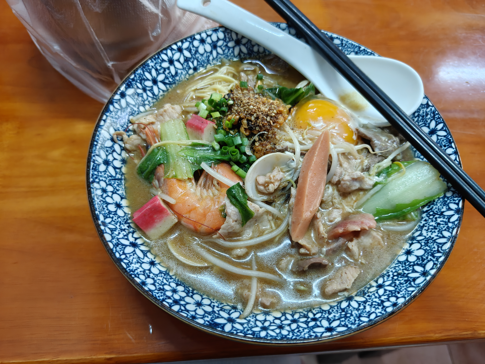

# 第1周周记

这周从深圳回到学校，节奏一下子松散了不少。实习和学校的转换有点突然，前两天还在出租屋里看知光项目，惦记着工资和报销的事，周三就拖着行李回到了宿舍。报销到账和工资发放算是这周里切切实实让人安心的事，虽然少算了几天工资，问人事后说要下个月补，心里还是有点不爽。

回来后基本是半学习半放松的状态。白天会看八股、改简历、完善项目亮点，周四晚上终于把简历投了出去，算是完成了一个阶段性的节点。但打游戏的时间明显多了起来，尤其是王者荣耀，几乎每天都会打上几把，周五晚上打完之后还叹了口气，有点控制不住自己。

周末的活动比较多。和顺和亮去海师打麻将、吃自助火锅，晚上被拉着住了一晚40块的宾馆，虽简陋但睡得还行。第二天又去唱K，我几乎全程在睡，然后吃了最近网上挺火的杨桃树焖面。回学校后把数据库实验作业一口气写完了，算是补上了这周的学习任务。想打个姬小满的万战结果没打上去，放弃了。

这周的小收获是：报销和工资都到账了，手机也换了新的，简历投出去了，周末和朋友聚了几次。也有点小遗憾：必胜客那杯茶没喝出以前的味，宿舍收拾完手汗症好像更严重了，游戏打得太多，效率需要再提高一点。

## 6.1
  周一，天气晴，早上八点多就醒了，洗漱一下然后下去买两瓶水喝，起来问了另一个实习生工资发没，也没发，接着继续学习知光项目了，学了一半一半吧，下午终于发工资了，不过5.21-5.28的没发，问人事说下个月再发，我去了，晚上打王者去了
## 6.2
  周二天气晴，早上醒来发现报销的钱到账了，爽歪歪，悬着的心终于放下了，奖励自己刷会抖音，准备买个手机，还是没买，下午打了会王者，然后去商场去吃必胜客，因为抖音刷到个团购，里面有个武夷大红袍红茶，之前和前任去必胜客吃的时候好像吃的就是这个，我很怀念，但是今天去吃似乎没有之前的韵味了，回来就继续看知光项目，简历上的亮点是掌握了大体了，除此之外还看了其他亮点，然后亮叫了我打课两次王者，第一次说在学习，第二次没办法了，就去打了，今晚就这样了
## 6.3
  周三天气晴，早上九点就醒了，看了下衣服有没有干，发现有些裤子还是没干，然后看了会抖音，家俊问我啥时候回去我就说今天，然后问我几点的车，我就说不急，接着他说不急就上号，也就打到了中午，收拾完直接去车站，大概四点到的学校，越峰依旧在睡觉哈哈，好累重的行李，应该是上班期间买了好多衣服的原因。还有一个一百块的枕头，嗯放下行李我就先去吃饭了，还奖励自己买了两个蛋挞吃，实在美味，接着去超市买牙膏，牙刷，洗发水，还去蜜雪买了杯薄荷奶绿，抖音上说是牙膏味，没想到还真是，好搞笑，回到宿舍我就在打巅峰赛，直接连胜了哈哈哈，不过最后一把队友直接给我来个哪吒发育路，这波神了，输了我也就没打了，宿舍阳台还有浴室都好脏，看不下去我就去搞干净了，真是一场酣畅淋漓的打扫啊，然后洗澡的时候我的手有点痛，我的手汗症有点严重了，，洗完又叫我打王者，今晚就这样啦。
## 6.4
  周四天气晴，今天一直在打王者，打了两个万战，然后下午手机到了，爽歪歪，晚上把简历完善了一下，直接开投！
## 6.5
  周五天气晴，早上起来看八股，下午打了好一会王者，然后继续看八股，晚上又打。。诶。。。
## 6.6
  周六天气晴，早上依旧看八股，玩了一把大巴扎，下午去海师找顺和亮打麻将，然后去吃自助火锅，吃撑了去海师逛逛，晚上亮说要住宾馆不想回去，让我陪着，耐不住他俩就没回学校了，于是在40块一晚的宾馆睡了一晚，说实话还可以，比深圳300块那个没差多少。
## 6.7
  周日天气晴，五点才睡着，起来去吃个粉汤，然后去日月广场那去唱k，主要是亮唱，我好困啊，一直在睡，唱了四个小时就来一个小红书爆火的地方吃焖面，叫做杨桃树焖面，拍了照片但是日记软件暂时没有上传图片的功能，吃完就回学校了，先洗个澡，然后写作业，直接把数据库实验的作业都做完了，然后想打一下姬小满的万战的，但是这英雄真的太牢了，打不了一点，放弃了，然后刷会抖音睡觉了。

  