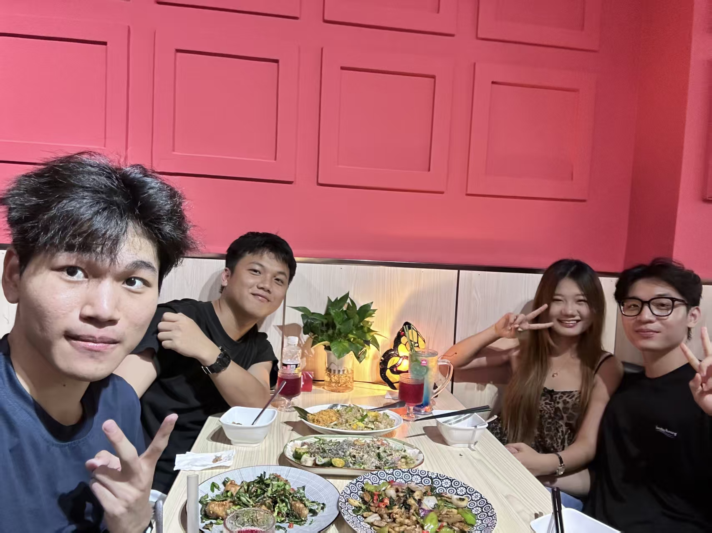

# 第2周周记

这周整体状态还行，学习上主要看了八股和langchain，把操作系统课设和实验都完成了，计网安全的答辩视频一直没录。项目方面把之前的agent项目捡起来搞了一下，还给日记软件加了上传图片功能。游戏上王者基本天天打，周末出了新模式玩了一下午，和朋友打游戏有时候会起冲突，想了想可能是自己脾气变差了。生活上周三睡了12个小时，周四去吃了肯德基帕尼尼，没什么特别的。周日去了招聘会投简历，忘了说自己是27届的，有点可惜。社交上周末和亮、浩一起吃了顿饭，还去云洞看了日落。

## 6.8
  周一天气晴，早上起来看了八股，下午睡到了四点，然后把大营销复习了，晚上打王者，还把日记软件增加了上传图片的功能，有点问题测试一下。

  
## 6.9
  周二天气阴，早上起来看了会langchain，下午看八股，晚上打王者
## 6.10
  周三天气晴，睡到中午才醒，下午又睡，今天睡了12个小时，起来把操作系统的课设做了，晚上去教个作业，然后回来就打王者。
## 6.11
  周四天气晴，昨晚聊到了早上吃什么，然后越峰说肯德基的帕尼尼不错，前女友之前经常提，于是决定明天试一下，然后羿飞说用淘宝代购会便宜许多，确实是这样，明早九点到肯德基也是吃上了，其实我觉得还行吧，没那么惊艳，吃完就来上课了，来问问系主任关于毕业实习的一些事情，中午回去玩了两把大巴扎就睡了，中午还是睡得有点多，实则效果一点都不好，决定以后睡半小时就行，然后起来就做操作系统的实验，做完了，晚上打王者，发现打王者和朋友总是会起冲突，是我脾气变差了吗。
## 6.12
  周五天气晴，昨晚睡不着，中午才醒，今天王者的超夯大乱斗出来了，于是我打了一下午😄，没招，下午决定自己vibe之前的agent项目，晚上没打王者，继续搞项目
## 6.13
  周六天气晴，早上起来把操作系统都实验交了，把计网安全的课设答辩的东西准备一下，但还没录制，中午打了好一会的超夯大乱斗，嗯然后下来看八股了，还速通了一下操作系统。还是没录制计网安全的答辩视频，然后亮说要来找我玩本来是说要来找我吃必胜客的，叫上浩了，他女朋友就问我们要不要去吃饭，就去了，吃完就随便逛逛，累死我了，晚上打会王者。

  
## 6.14
  周日天气晴，早上八点多起来，然后去体育馆招聘会投个简历，没有面试，只是简单了解一下，刚去就发现有个人比我还先来，不过我忘记说我是27届的了，这波可惜了，然后回来看八股，一直在看。。还看了learn-claude-code的项目讲解，速通的，然后下午陪亮去云洞看日落，接着去华彩湾吃必胜客，回来继续打王者.