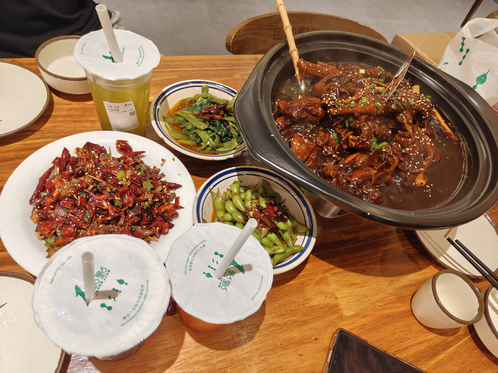

# 第1周周记

## 7.1
  周三天气晴，早上去上所谓的ai数据标注讲座了，没意思，真没意思，然后下午签完到我就去医院看三爹，到房间了三爹好像在睡觉，我也不知道是不是他。。然后四处搜寻发现刚刚那个房间里的不是三爹，只有三妈在，寒暄了一下，三妈让我去找四爹，于是我就跟四爹到处跑，盖章什么的，接下来我去找一下仕涛，买了奶茶给他，让他懂事一点，好好学习，接着我就坐公交坐到万绿园，接着骑自行车去云洞图书馆逛了一下，是想在世纪大桥上欣赏落日的，没等到亮打电话问我要不要去吃饭，然后我说不吃烤肉吃肉蟹煲，于是就打车去找他们了。我们去了龙湖天街，本来想吃肉蟹煲的，但是突然想起周黑鸭，于是我们就吃了这个，我去好辣，但其实我感觉不如肉蟹煲。然后我们就逛了一会，去理想车点逛了一下哈哈，还加了店员微信，他俩称呼我为老板，于是我让店员等我10年哈哈。然后回去顺宿舍把车胎补了一下，然后再陪亮吃个清补凉，我开顺他弟弟的车回学校，到时候上班就开这车，回来舍友说会定期搜查通行证，抓到会处分，给我吓的，但还是明天再把车开去外面吧，然后洗澡，接着直接看astroblog的issue，我决定从issue入手开源。

  
## 7.2
  周二天气晴，中午去实验室把课设和作业交了，吃饭睡觉，下午看了会nanobot把架构稍微学了下，然后学长说把领双证的资料给我，然后请我吃饭，耐不住他，于是去了北门吃个安徽板面，跟我讲诉一些他的经验什么的，跟着他一起把他的毕业论文打印完，我就回宿舍了，接着锻炼洗澡打王者，把 nanobot的框架过完了，然后学习pi的。
## 7.3
  周五天气晴，中午醒的，吃饭完打了会王者，睡了半个小时，然后起来把pi的框架过完，又接着把astrbot的过了，但感觉这样过了好像也没啥用，不知道该怎么学习了。。诶，先去南门吃个炒米粉吧，途中买了杯木棉花的鸭先知，还不错，店员不小心给我搞成大杯了，然后很多冰，特意加我微信和我说了一下，哈哈哈，吃得好饱，回来就没打算锻炼了，洗个澡打了一晚上王者，我又陷入迷茫了，不知道怎么入门开源，也不知道该不该做自己的agent。。
## 7.4
  周六天气晴，依旧中午醒，看了一下午小说，接着去北门的藤野造型剪头发，本来只是想剪个微分碎盖的，被忽悠去烫钢夹塑形了，不是想要的效果，算了，问题不大，回来就打王者。
## 7.5
  周日天气晴。还是中午才醒的，下午又看了关于考公的知识，但还是没决定是否还要考公，感觉好麻烦，我最讨厌麻烦了，晚上说要锻炼的，家俊教我打王者，明天就上班了，算了就再打一天吧，有点太上头了。
## 7.6
  周一天气晴，今早入职去了，到了发现是要自带电脑的，我去不早说，然后我就看八股，好无聊，中午回去拿电脑，然后下午mt让我看芋道框架的相关知识，下班锻炼洗澡，做个人agent，练琴，看小说睡觉。
## 7.7
  周二天气晴，早上还是熟悉框架，昨天就是光看但是没有实际体验，于是早上就在使用这个框架添加新的模块以及使用代码生成器生成重复的代码，然后mt说使用cursor开发，可以报销，于是我就先买了一个月的pro，说是等到时候吃饭开发票报销，嗯下午快下班的时候我说我掌握的差不多了，然后mt让我看一下金仓的用法，我觉得我不应该摸鱼了，我得快点接触项目，不然又是一段没有产出的实习经历，然后下班我没有回去学校，我在做个人的智能体，完成了对qq和飞书平台的对接，记忆隔离和流式输出，但是我还没有仔细看，明天再看吧，弄完流式输出我就回学校了，锻炼洗澡，再学会钢琴，看会小说睡觉。